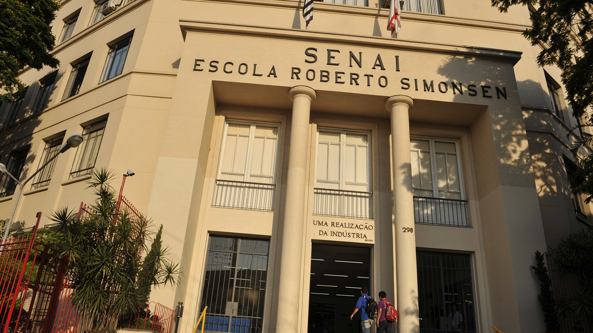

# Programação em Python
Professor Daniel Santos 
Turma: PYTHON 2402SG
 
Início: 27/01/2024 
Término: 13/04/2024

Carga horária 120 hrs 
Sábado das 09h10 às 18h10.

# RESUMO
O curso de Aperfeiçoamento Profissional de Programação em Python tem por objetivo o desenvolvimento de competências relativas a programação utilizando codificações na linguagem Python com diferentes níveis de complexidade, seguindo manuais técnicos de boas práticas de programação

 

# PROGRAMAÇÃO DO CURSO

- Introdução à computação
- Lógica de programação
- Introdução ao Python
- Conceitos de Programação em Python
- Estruturas de repetição
- Estrutura de dados no Python
- Módulos e pacotes

# SenaiPython2024
SenaiPython2024